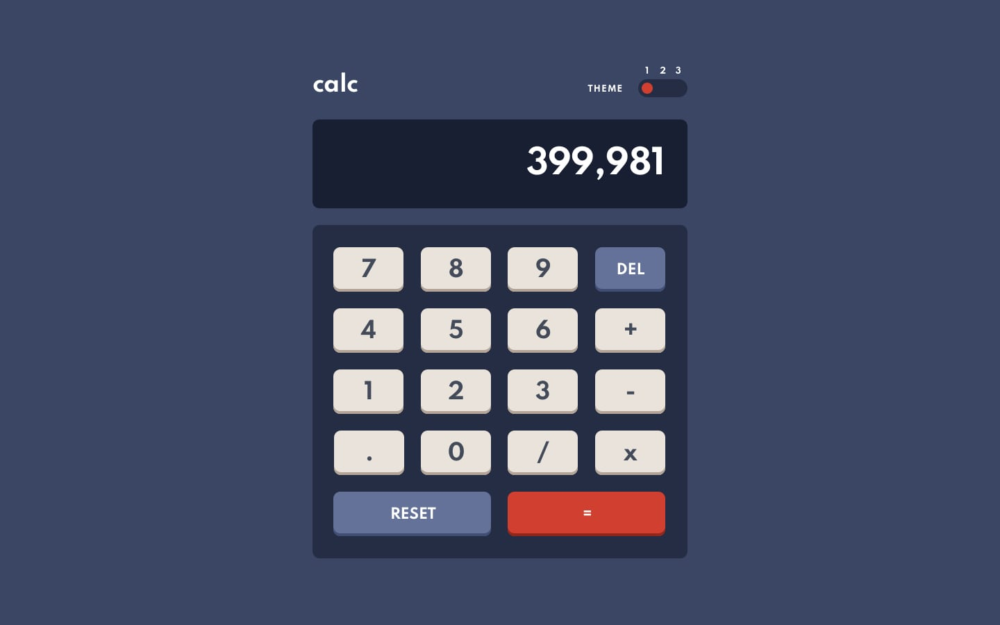

# Calculator.io
URL https://calculator.alissanguyen.dev

A simple calculator app with basic math functions and theme toggle.

### What to expect

### Functionality
>Users are able to:
>
>- See the size of the calculator adjust based on their device's screen size
>- Perform mathematical operations like addition, subtraction, multiplication, and division
>- Use both the keyboard and the mouse to enter data into the calculator
>- Adjust the color theme based on their preference with a customizable widget

### Built with

 - Webpack
 - SCSS
 - BEM methodology
 - Mobile first
 - Semantic HTML5 markup
 - JavaScript
 - Flexbox
 - Grid
 - vanilla-picker library

### Useful resources
 - [LINK - webpack](https://laravel-mix.com/docs/6.0/what-is-mix)
 - [LINK - vanilla-picker library](https://vanilla-picker.js.org/?fbclid=IwAR03FvlXZmEnrPI6_NJAHwD056kdFzlze2lE5TGUCkB0P-_sOHerHNpnFtY)
 - [LINK - prefers-color-scheme](https://developer.mozilla.org/en-US/docs/Web/CSS/@media/prefers-color-scheme)
 - [LINK - How to detect user prefered theme in JS](https://ourcodeworld.com/articles/read/1114/how-to-detect-if-the-user-prefers-a-light-or-dark-color-schema-in-the-browser-with-javascript-and-css).
 - [LINK - Focus trap](https://uxdesign.cc/how-to-trap-focus-inside-modal-to-make-it-ada-compliant-6a50f9a70700)
 - [DOCS - toLocaleString()](https://developer.mozilla.org/en-US/docs/Web/JavaScript/Reference/Global_Objects/Number/toLocaleString)
 - [LINK - Write your own javascript contracts and docstrings](https://dev.to/stephencweiss/write-your-own-javascript-contracts-and-docstrings-42ho)
 - [LINK - Object literals](https://betterprogramming.pub/dont-use-if-else-and-switch-in-javascript-use-object-literals-c54578566ba0).